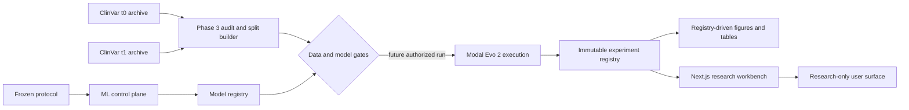

# EvoVariant-TR

EvoVariant-TR is research software for a frozen temporal benchmark of genomic
variant-effect scores. The project preserves the original zero-shot Evo 2
estimand and adds a separately controlled ML-extension surface for future
representations, classical models, calibration, ensembling, and robustness
experiments.

> **Research-only boundary:** this repository does not provide a clinical
> diagnosis, treatment recommendation, or patient-level risk estimate. Raw
> sequence signals and any future calibrated study probabilities are meaningful
> only under their registered protocol and evidence stage.

## Current verified status

The current branch is `research/evovariant-tr`. The project-control state is
`BLOCKED / PARTIAL` at the final release gate. The free/local engineering
surfaces are reproducible, but the scientific execution gates are intentionally
closed:

| Area | Current evidence |
|---|---|
| Frozen protocol and ML-extension control plane | PASS; the original protocol hash is preserved. |
| Phase 3 data and splits | Structural invariants PASS, with a documented QA-count discrepancy; downstream scoring is blocked until resolved or approved by deviation. |
| Model registry | Seven schema-valid candidate manifests; Evo2 is included with verified provenance and one real smoke, while six candidates are explicitly deferred/infeasible. |
| Modal | Authorized Evo2 7B H100 pilot passed a real cache miss and equivalent cache hit; workspace billing is recorded, with no exact per-request invoice asserted. |
| Experiment registry | Empty; no scientific result artifact is registered. |
| Research workbench | Frontend build and four browser tests PASS; scientific panels remain evidence-gated. |
| Figures and tables | Registry-driven manifest and export bundle are deterministic but `BLOCKED` because no eligible completed scientific outputs exist; the bundle contains no scientific outputs. |
| Spend | Local work was `$0`; the bounded pilot-family workspace delta was approximately `$0.33`, billed cost `$0.00`, and per-request measured USD is unavailable. |

The authoritative execution state is maintained in
[`CODEX_MASTER_PROMPT.md`](CODEX_MASTER_PROMPT.md),
[`docs/agent/PROJECT_STATE.md`](docs/agent/PROJECT_STATE.md),
[`docs/agent/PHASE_LEDGER.md`](docs/agent/PHASE_LEDGER.md), and
[`docs/agent/DECISIONS.md`](docs/agent/DECISIONS.md). Historical milestone
reports under `docs/project/` are retained as history and are not a substitute
for the current ML-extension gate.

## Quick start: free local validation

The default setup and validation path does not install CUDA or download model
weights.

```bash
make bootstrap
cd apps/web && npm ci && cd ../..
make validate
make web-check
make web-e2e
```

Useful additional checks are:

```bash
make protocol-verify
make ml-protocol-verify
make schema-verify
make model-registry-verify
make registry-verify
make test-scientific
make test-e2e
make figures
```

At the verified current baseline, `make validate` passes 649 tests with 33
deselected and 95.08% coverage. The scientific tier passes 7 tests with 1
explicit skip, the API/E2E tier passes 14 tests with 1 explicit skip, and
`make web-e2e` passes 4 local Playwright tests. The exact evidence and warnings
are recorded in the project-control files.

## What the project measures

The frozen primary estimand is:

> Among unique normalized germline GRCh38 SNVs recorded as VUS in the fixed
> historical ClinVar release at t0 and later receiving a definitive B/LB or
> P/LP classification meeting the prespecified review-status gate at t1, how
> well does a frozen zero-shot Evo 2 allele-likelihood score distinguish the
> direction of that later resolution?

The primary protocol fixes:

- t0: ClinVar `variant_summary` archived for 2025-01-02;
- t1: ClinVar `variant_summary` archived for 2026-08-06;
- assembly: GRCh38;
- unit: unique normalized biallelic A/C/G/T germline SNV;
- t1 outcomes: P/LP versus B/LB with the primary review-status gate;
- sequence context: exactly 8,192 bases;
- score: forward and reverse-complement raw components retained, with
  `delta_primary = (delta_fwd + delta_rc) / 2`;
- calibration and threshold choices: never fit using locked-test labels.

The Phase 3 archives are hash-verified. Their current recomputation yields
1,402,895 unique valid t0 VUS IDs and 946 final temporal records (536 B/LB,
410 P/LP). The validation-only handoff target was 1,403,225 and 1,024. The
difference is documented and has not been tuned away; no model scoring is
authorized until the discrepancy is resolved from source evidence or accepted
through the dated deviation process.

## Architecture



The current repository contains the contracts and fail-closed execution
scaffolding. A tiny authorized Evo2 deployment and remote cache artifact now
exist, but they are engineering-gate evidence only and do not constitute a
cohort benchmark or scientific result.

## Repository map

```text
.
├── CODEX_MASTER_PROMPT.md       # authoritative execution instruction
├── COMMAND_REFERENCE.md         # free/gated command reference
├── Makefile                     # project control surface
├── docs/agent/                  # persistent state, decisions, ledger, runbook
├── research/protocol/           # frozen original protocol and deviation log
├── research/ml_extension/       # additive ML protocol, model registry, split policy
├── research/schemas/             # strict JSON Schemas
├── experiments/registry/        # append-only run records (currently empty)
├── src/evovariant_tr/           # typed research and control-plane package
├── apps/web/                    # Next.js research workbench
├── evo2_scorer_app.py           # canonical Modal entrypoint; pilot evidence is in artifacts/
├── scripts/                     # validation, manifest, registry, and operational tools
├── tests/                       # unit, contract, integration, scientific, API/E2E, Modal
└── data/                        # local/ignored archives and derived Phase 3 outputs
```

## Research workbench

Run the frontend from `apps/web` after installing its dependencies:

```bash
cd apps/web
npm run dev -- --port 3001
```

Open `/analysis` to inspect the evidence-gated workbench. It exposes all 14
required areas:

- Overview;
- Single Variant Research Analysis;
- Temporal VUS Explorer;
- Model Benchmark;
- Representation / Layer Analysis;
- Training & Hyperparameter Experiments;
- Fine-Tuning Experiments;
- Ensemble Analysis;
- Calibration & Abstention;
- Robustness & Ablation;
- Error Analysis;
- Batch VCF/CSV;
- Methods & Provenance;
- Experiment Registry.

The current UI can load frozen protocol metadata and can render raw research
signals only when an explicitly configured real scorer serves them. It does not
fall back to `FakeScorer`, derive clinical labels, invent metrics, or mark
downstream areas ready because a planned run exists. The Experiment Registry
tab reads safe metadata from `/api/registry`; the current empty registry is
shown as `BLOCKED`.

## Data and reproducibility

The local archive-backed Phase 3 command is:

```bash
make data-qc
```

It rebuilds ignored record-level outputs under
`data/derived/ml_extension/phase3/` and validates deterministic split and
leakage invariants. The current split manifest hash is
`96d3e20e3cd97cb583b6b3d156ecd473c88ab66670704b1facb457351626ef72`, and its
content split hash is
`bac30ed0a818258445a7340b1e96fe592902af5d4d7e899fbe227d24af955722`.

The raw archives are local, ignored data. Their identity is recorded in:

- `research/data_manifests/clinvar_t0.json`;
- `research/data_manifests/clinvar_t1.json`;
- `research/ml_extension/splits/phase3_manifest_summary.json`.

The summary is the reviewable source of truth for the discrepancy and explicitly
sets `model_scoring_allowed` to false until the gate is resolved.

## Experiment registry and figures

Every future run must be registered with protocol, git, dataset/split, model,
license, configuration, hardware, runtime/cost, metrics, artifact, and failure
metadata. The registry is append-only, terminal states are final, and completed
output hashes are recomputed by:

```bash
make registry-verify
```

The Section 21 metadata contract is implemented in
`src/evovariant_tr/registry.py` and
`research/schemas/experiment_run.schema.json`. The current registry contains no
run records.

Figure and table input discovery and export are deliberately registry-driven:

```bash
make figures
```

This writes a deterministic metadata manifest under the ignored
`research/runs/` directory and a bundle manifest under
`research/figures/bundle_manifest.json`. The Phase 17 contract covers all 19
required figure families and 12 required tables. With no eligible completed
PRELIMINARY or FINAL outputs it reports `BLOCKED`, removes only outputs listed
by the prior bundle manifest, and produces no scientific figures, tables,
placeholder metrics, or inferred values. When registered inputs eventually
make the manifest `READY`, the bundle renderer emits hash-addressed SVG figures,
JSON tables, methods, limitations, cost, and model-provenance artifacts under
`research/figures/bundle/`.

## Modal and paid compute

The canonical identity is app `evovariant-tr`, volume `hf_cache`, H100, the
pinned NGC PyTorch image, and Evo2 revision
`4b509ec2a22d6de472659f908bcb0714265ad3a7`. Under the dated user approval,
deployment v3 (`phase2-pilot-20260921-r1`) loaded `evo2_7b` and verified one
real prediction-cache miss plus an identical cache hit for
`GRCh38:chr10:100065200:C>T`. The raw output is research-only and carries no
clinical classification.

```bash
make modal-smoke
```

This remains a no-spend preflight for fresh environments. The completed pilot
evidence is recorded separately in
`artifacts/modal/phase2_phase4_pilot_20260921_success.json`; its superseded
chromosome-prefix failures are preserved alongside it.

Paid execution requires the explicit acknowledgement
`EVOVARIANT_TR_PAID_COMPUTE_ACK=I_ACCEPT_COSTS` and the project-specific approval
gates described in `docs/agent/MODAL_COMPUTE_POLICY.md`. The current approval is
exhausted for the tiny pilot family; do not start a full benchmark, training,
HPO, fine-tuning, or locked-test run while the Phase 3 discrepancy and
multi-model inclusion gates remain unresolved.

## Phase status

The dependency-ordered phase decisions are maintained in
[`docs/agent/PHASE_LEDGER.md`](docs/agent/PHASE_LEDGER.md). In brief:

- Phases 0 and 1 are complete;
- Phase 2 and Phase 4 pass their engineering gates with the corrected remote
  Evo2 miss/hit evidence;
- Phase 3 is reopened because its 330-ID and 78-record/class-count discrepancy
  is material to downstream denominators;
- Phase 5 has audited all seven candidates but remains blocked for multi-model
  inclusion because only Evo2 has verified raw-SNV parity and smoke evidence;
- Phases 6–15 have explicit blocked status artifacts and no scientific metrics;
- Phase 16's frontend/build/browser engineering gate passes, but its scientific
  result dependency is absent;
- Phase 17's registry-driven manifest and export bundle are deterministic but
  have no eligible inputs and therefore contain no scientific outputs;
- Phase 18's free clean-room gate passes, while full scientific and figure
  evidence remain unavailable;
- Phase 19 remains blocked and no release, tag, deployment, or publication is
  claimed.

## Legacy evidence boundary

The repository retains historical legacy application code, reports, and ignored
evaluation snapshots for auditability. They are not current ML-extension
results. In particular, the former BRCA1 threshold/confidence classifier and
old Modal endpoint identity must not be used as evidence for the frozen temporal
benchmark. Current code fails closed when a real scorer or registered artifact
is unavailable.

## Responsible use

ClinVar review stars are a review-status proxy, not biological certainty. The
benchmark is conditional on eventual historical resolution and does not estimate
whether every VUS will be reclassified, when it will be reclassified, patient
diagnosis, treatment, clinical management, or causal pathogenicity.

Never present a raw model score, calibrated study probability, or empty-state
status as a clinical conclusion. Preserve protocol hashes, data hashes, model
identity, evidence stage, failure records, and cost records for every future
run.

## References

- [Frozen original protocol](research/protocol/PROTOCOL.md)
- [ML-extension protocol](research/ml_extension/PROTOCOL.md)
- [Command reference](COMMAND_REFERENCE.md)
- [Project state](docs/agent/PROJECT_STATE.md)
- [Phase ledger](docs/agent/PHASE_LEDGER.md)
- [Decisions](docs/agent/DECISIONS.md)
- [Testing and validation](docs/agent/TESTING_AND_VALIDATION.md)
- [Modal compute policy](docs/agent/MODAL_COMPUTE_POLICY.md)
- [Evo2 repository](https://github.com/ArcInstitute/evo2)
- [UCSC Genome Browser API](https://api.genome.ucsc.edu)
- [NCBI ClinVar](https://www.ncbi.nlm.nih.gov/clinvar/)
