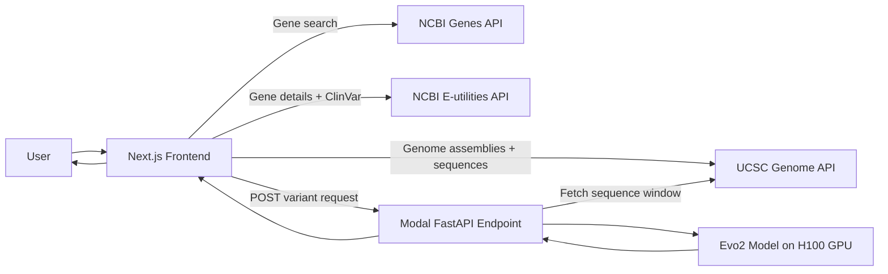

# EvoVariant-TR

**EvoVariant-TR** — *Temporal Resolution of Variants of Uncertain Significance with Frozen Zero-Shot Evo 2 Allele-Likelihood Scoring.*

A full-stack, research-grade platform for scoring human genetic variants using the Evo 2 genomic language model. The system fetches reference sequence context, computes allele log-likelihoods with Evo 2, and produces variant-effect scores for ClinVar VUS (Variant of Uncertain Significance) resolution benchmarking.

> :warning: **Research-only software.** Outputs are study probabilities under a specific temporal benchmark protocol — not a clinical diagnosis for any individual. See [Responsible Use](#responsible-use).

---

## Table of Contents

1. [Quick Start](#quick-start)
2. [What It Does](#what-it-does)
3. [Science Foundations](#science-foundations)
4. [System Architecture](#system-architecture)
5. [Repository Map](#repository-map)
6. [Frontend Guide](#frontend-guide)
7. [Backend & Deployment](#backend--deployment)
8. [Development](#development)
9. [GPU / Paid Compute](#gpu--paid-compute)
10. [Testing](#testing)
11. [Data & Protocol](#data--protocol)
12. [Troubleshooting](#troubleshooting)
13. [Responsible Use](#responsible-use)
14. [References](#references)

---

## Quick Start

```bash
# 1. Clone and set up Python environment
git clone https://github.com/utkarshmer05/evovariant-tr.git
cd evovariant-tr
make bootstrap

# 2. Run full local validation (free, CPU-only)
make validate

# 3. Start frontend
cd apps/web
npm install
npm run dev -- --port 3001

# 4. Open in browser
open http://localhost:3001
```

For GPU-powered variant scoring, see [GPU / Paid Compute](#gpu--paid-compute).

---

## What It Does

EvoVariant-TR answers: **"Given a specific single nucleotide change in a gene, does the mutation look likely benign or likely pathogenic?"**

At runtime, the system:

1. Takes a user-selected genomic position and alternative base (A/T/G/C).
2. Fetches a reference sequence window (8,192 bp centered on the variant).
3. Scores both reference and mutated sequences with Evo 2.
4. Computes a delta log-likelihood score.
5. Maps that score to a prediction with a confidence estimate.
6. Displays results alongside known ClinVar classifications.

### Example Workflow

1. Search for a gene (e.g., `BRCA1`) or browse by chromosome.
2. Click a nucleotide in the sequence view to pre-fill a variant position.
3. Select an alternative base and submit.
4. View the Evo 2 variant-effect score, prediction, and ClinVar comparison.

---

## Science Foundations

### DNA, Genes, and SNVs

- DNA uses a 4-letter alphabet: **A**, **T**, **G**, **C**.
- Genes are functional regions on chromosomes.
- An SNV changes one nucleotide at one genomic position.

Example: Reference base `A` at position 43044295, variant base `T` → written as `A>T`.

### Variant Effect Prediction

Variant effect prediction estimates whether a variant likely disrupts biological function:

- **Likely pathogenic** — variant pattern resembles harmful variants more strongly.
- **Likely benign** — variant pattern resembles non-harmful variants more strongly.

:warning: This is a research/decision-support signal, not a standalone clinical diagnosis.

### Why a Language Model for DNA?

Evo 2 is a genomic language model. Like text LLMs learn token patterns, Evo 2 learns nucleotide patterns. A biologically plausible sequence receives a relatively higher likelihood; a disruptive mutation can reduce sequence likelihood in context.

### Core Scoring Logic

The backend computes:

$$\Delta = s_{variant} - s_{reference}$$

Where:
- $s_{reference}$ is the Evo 2 score for the unmodified sequence window
- $s_{variant}$ is the Evo 2 score after substituting one nucleotide
- More negative $\Delta$ indicates stronger loss-of-function tendency

**Decision rule:**

$$\mathrm{prediction} = \begin{cases} \mathrm{Likely\ pathogenic}, & \Delta < t \\ \mathrm{Likely\ benign}, & \Delta \ge t \end{cases}$$

Where $t$ is the calibrated threshold from the BRCA1 benchmark.

**Confidence rule:**

$$\mathrm{confidence} = \min\left(1, \frac{|\Delta - t|}{\sigma}\right)$$

Where $\sigma$ depends on the prediction class (LOF or benign/FUNC standard deviation).

---

## System Architecture



### Components

| Layer | Technology | Purpose |
|---|---|---|
| **Frontend** | Next.js 15, React 19, TypeScript, Tailwind CSS | Interactive genome exploration and variant analysis UI |
| **API Gateway** | Next.js API Routes | Proxies requests to Modal backend (avoids CORS) |
| **Backend** | Modal serverless GPU, FastAPI, Python 3.12 | Evo 2 model serving and variant scoring |
| **Model** | Evo 2 (7B parameters) | Genomic sequence likelihood scoring |
| **Data Sources** | UCSC Genome Browser API, NCBI ClinVar | Gene metadata, sequences, and known variants |

---

## Repository Map

```text
evovariant-tr/
├── README.md                           # This file
├── COMMAND_REFERENCE.md                # Canonical command reference
├── Makefile                            # Single project control surface
├── pyproject.toml                      # Python package definition (evovariant_tr)
├── requirements.txt                    # Backend runtime requirements
├── evo2_scorer_app.py                  # Modal deployment entry point
├── AGENTS.md                           # Agent instructions
│
├── apps/
│   └── web/                            # Next.js frontend
│       ├── src/app/                    # App Router pages
│       ├── src/components/             # UI components
│       ├── src/utils/genome-api.ts     # External API adapter layer
│       └── src/env.js                  # Environment validation
│
├── src/
│   └── evovariant_tr/                  # Core Python package
│       ├── api.py                      # Public API interface
│       ├── batch.py                    # Batch processing & resumability
│       ├── cli.py                      # CLI entrypoint
│       ├── clinvar.py                  # ClinVar parsing & normalization
│       ├── cohort.py                   # Cohort construction
│       ├── config.py                   # Configuration management
│       ├── cost_policy.py              # Cost control & approval policies
│       ├── evo2_scorer.py              # Evo 2 model scoring interface
│       ├── fake_scorer.py              # Deterministic test scorer
│       ├── manifest.py                 # File manifest & hashing
│       ├── metrics.py                  # Scoring metrics & evaluation
│       ├── modal_config.py             # Modal configuration
│       ├── model_cache.py              # Model caching
│       ├── registry.py                 # Experiment registry
│       ├── scorer.py                   # Scorer interface
│       ├── scoring_record.py           # Scoring result records
│       ├── sequence_cache.py           # Sequence caching
│       ├── sequence_window.py          # Sequence window extraction
│       └── ...                         # More modules (full list below)
│
├── scripts/                            # Operational scripts
│   ├── check_secrets.sh                # Secret scanner
│   ├── deploy_modal.sh                 # Modal deployment script
│   ├── patch_vortex.py                 # Attention interface compatibility patch
│   ├── validate_local.sh               # Full local validation
│   ├── verify_manifest.py              # Manifest verification
│   └── verify_registry.py              # Registry verification
│
├── tests/                              # Test suite (570 tests)
│   ├── unit/                           # Unit tests
│   ├── contract/                       # Contract tests
│   ├── integration/                    # Integration tests
│   ├── scientific/                     # Scientific validation tests
│   ├── modal/                          # Modal infrastructure tests
│   └── e2e/                            # End-to-end tests
│
├── research/                           # Research protocol & outputs
│   ├── protocol/protocol.yaml          # Frozen research protocol (v1.0.0)
│   ├── schemas/                        # Schema definitions
│   ├── data_manifests/                 # Data manifests
│   └── results/                        # Scoring results (frozen)
│
├── data/                               # Local data (gitignored)
│   └── manifests/                      # File manifests
│
├── artifacts/                          # Generated artifacts
│   └── approvals/                      # Approval artifacts
│       └── full_run_approval.json      # Full-run GPU approval
│
├── docs/                               # Documentation
│   ├── project/                        # Project documentation
│   ├── terminology/                    # Scientific terminology
│   └── ...                             # Other docs
│
└── evaluation/                       # Evaluation framework
```

---

## Frontend Guide

### Stack

- **Next.js 15** (App Router)
- **React 19** + TypeScript
- **Tailwind CSS** + shadcn/ui components
- **Zod** + @t3-oss/env-nextjs for environment validation
- **Turbopack** for fast dev compilation

### Development

```bash
cd apps/web
npm install          # or: npm ci
npm run dev          # Starts on http://localhost:3001
npm run build        # Production build
npx tsc --noEmit     # TypeScript type checking
npm run lint         # ESLint
```

### Environment Variables

Create `apps/web/.env.local`:

```bash
# Modal scoring endpoint URL
NEXT_PUBLIC_ANALYZE_SINGLE_VARIANT_BASE_URL=https://utkarshmer05--evovariant-tr-evo2scorerservice-score-variant.modal.run
```

### Main Components

| Component | File | Purpose |
|---|---|---|
| **HomePage** | `src/app/page.tsx` | Gene search and chromosome browsing |
| **GeneViewer** | `src/components/gene-viewer.tsx` | Orchestrates gene analysis workspace |
| **VariantAnalysis** | `src/components/variant-analysis.tsx` | Variant entry and prediction display |
| **GeneSequence** | `src/components/gene-sequence.tsx` | Sequence visualization with slider |
| **KnownVariants** | `src/components/known-variants.tsx` | ClinVar variants table |
| **ComparisonModal** | `src/components/variant-comparison-modal.tsx` | ClinVar vs Evo2 comparison |

---

## Backend & Deployment

### Architecture

The backend is a **Modal serverless GPU application** that:

1. **Loads Evo 2** (`evo2_7b`) once per warm container via `@modal.enter()`
2. **Scores variants** via a FastAPI web endpoint
3. **Fetches sequence context** from the UCSC API
4. **Returns JSON** with reference/variant scores and predictions

### Deployment

```bash
# Ensure cost acknowledgement is set
export EVOVARIANT_TR_PAID_COMPUTE_ACK=I_ACCEPT_COSTS

# Deploy
./scripts/deploy_modal.sh
# or: modal deploy evo2_scorer_app.py
```

### Container Configuration

| Setting | Value |
|---|---|
| **GPU** | NVIDIA H100 80GB |
| **Base Image** | nvcr.io/nvidia/pytorch:24.07-py3 |
| **CUDA** | 12.4 |
| **PyTorch** | 2.4.0+cu124 |
| **Transformer-Engine** | 1.13 |
| **Flash-Attention** | 2.6.3 |
| **Max Containers** | 3 |
| **Retries** | 2 |
| **Scale-down** | 120s |

### API Contract

#### Request

```json
{
  "chromosome": "chr17",
  "variant_position": 43044295,
  "alternative": "T",
  "genome": "hg38"
}
```

#### Response

```json
{
  "variant": "chr17:g.43044295A>T",
  "reference_score": -0.964,
  "alternate_score": -0.964,
  "score_delta": 0.0,
  "status": "completed",
  "provenance": {
    "scorer": "evo2_7b",
    "context_length": 8192,
    "strand": "forward",
    "scoring_semantics": "log_likelihood_ratio"
  }
}
```

---

## Development

### Prerequisites

- **Python 3.12** (required)
- **Node.js 20+** and npm
- **Modal CLI** (`pip install modal`) — for GPU deployment only
- **Git** — for repository operations

### Environment Setup

```bash
# Python backend
make bootstrap              # Creates .venv, installs core + dev dependencies

# Frontend
cd apps/web
npm install                 # or: npm ci

# Activate Python environment
source .venv/bin/activate
```

### Makefile Commands

| Command | Description |
|---|---|
| `make help` | Show all available targets |
| `make bootstrap` | Set up Python environment |
| `make validate` | Full local validation (free) |
| `make lint` | Ruff linter |
| `make typecheck` | mypy strict type checking |
| `make test` | Run unit, contract, integration tests |
| `make coverage` | Run tests with coverage |
| `make protocol-verify` | Validate frozen protocol |
| `make gpu-pilot` | Run GPU pilot (requires cost ack) |
| `make gpu-full` | Run full GPU scoring (requires approval) |

### Direct Commands

```bash
# Validation
ruff check src tests scripts
mypy --strict src
pytest tests/unit tests/contract tests/integration -q

# Protocol verification
evovariant-tr validate-protocol --protocol research/protocol/protocol.yaml

# CLI
evovariant-tr --help
```

---

## GPU / Paid Compute

:warning: **These operations incur paid GPU costs on Modal.**

### Cost Control Policy

All paid compute is gated by:

1. **Environment variable**: `EVOVARIANT_TR_PAID_COMPUTE_ACK=I_ACCEPT_COSTS`
2. **Approval artifact**: `artifacts/approvals/full_run_approval.json` (for full runs)
3. **Modal identity check**: The old project identity (`variant-analysis-evo2`) is forbidden

### Running GPU Tests

```bash
export EVOVARIANT_TR_PAID_COMPUTE_ACK=I_ACCEPT_COSTS

# Pilot run (small, multi-gene)
make gpu-pilot

# Full primary scoring (requires approval artifact)
make gpu-full
```

### Full-Run Approval

Create `artifacts/approvals/full_run_approval.json`:

```json
{
  "approved_by": "your-name",
  "approved_at": "2026-08-19T13:40:00Z",
  "max_budget_usd": 500.0,
  "run_scope": "full_primary_evo2_scoring",
  "modal_environment": "evovariant-tr",
  "gpu_type": "H100",
  "protocol_hash": "frozen_v1.0.0_2026-08-18"
}
```

---

## Testing

### Test Taxonomy

| Tier | Markers | Cost | Description |
|---|---|---|---|
| Unit | (default) | Free | Pure logic tests |
| Contract | (default) | Free | Interface & schema tests |
| Integration | (default) | Free | Multi-component tests |
| Scientific | `--run-scientific` | Free | Scientific validation |
| E2E | `--run-e2e` | Free | End-to-end tests |
| Modal | `--run-modal` | Paid | GPU infrastructure tests |

### Running Tests

```bash
# Default (free tiers only)
make test

# Include scientific and e2e (free)
pytest --run-scientific --run-e2e tests/

# Include modal (paid)
EVOVARIANT_TR_PAID_COMPUTE_ACK=I_ACCEPT_COSTS \
  pytest --run-modal tests/ -o "addopts="
```

### Current Status

```
ruff check:        All checks passed
mypy --strict:     Success: no issues found in 35 source files
pytest:            570 passed, 3 skipped
```

---

## Data & Protocol

### Research Protocol

The frozen protocol is at `research/protocol/protocol.yaml` (v1.0.0, frozen 2026-08-18).

```bash
# Validate protocol
make protocol-verify

# Or directly
evovariant-tr validate-protocol
```

### Data Sources

| Source | Purpose |
|---|---|
| ClinVar (2025-01-02 & 2026-08-06) | VUS cohorts and classifications |
| GRCh38 reference | Reference genome sequence |
| UCSC Genome API | Sequence context for variant scoring |
| NCBI E-utilities | Gene metadata and ClinVar details |

### Cohort

- **Primary cohort**: Temporal variants resolved between t0 and t1
- **Calibration cohort**: Definitive variants at t0 for threshold calibration
- **Gene groups**: Disjoint gene splits for cross-validation

---

## Troubleshooting

### Frontend: env validation fails

```
invalid_type: Required at path: NEXT_PUBLIC_ANALYZE_SINGLE_VARIANT_BASE_URL
```

**Fix**: Create `apps/web/.env.local` with the Modal endpoint URL (see above).

### Backend: Modal container fails to start

Check that you have:

1. Authenticated with Modal: `modal login`
2. Set cost acknowledgement: `export EVOVARIANT_TR_PAID_COMPUTE_ACK=I_ACCEPT_COSTS`
3. Old project identity is not used: the app must be named `evovariant-tr`

### Backend: FP8 / compute capability error

```
RuntimeError: Device compute capability 8.9 or higher required for FP8 execution.
```

This indicates the GPU doesn't meet FP8 requirements. Ensure you're using an H100 GPU (compute capability 9.0).

### Frontend: Hydration failed warning

This is a browser extension artifact. It does not affect functionality. Refresh the page or try an incognito window.

### No ClinVar variants shown

- Try a different gene
- Click refresh in the known variants panel
- Check if the UCSC/NCBI APIs are responding

---

## Responsible Use

**EvoVariant-TR is research software.** All outputs are study probabilities under a specific temporal benchmark protocol:

- The system produces **variant-effect scores**, not clinical diagnoses.
- Calibrated outputs are **study probabilities**, not clinical probabilities for an individual.
- The benchmark measures **discrimination of later resolution direction** among historically-VUS variants.
- Every user-facing surface must display the **research-only** boundary.

See `docs/terminology/EVIDENCE_STAGES.md` for evidence stage definitions and `docs/terminology/GLOSSARY.md` for scientific term definitions.

---

## References

- **Evo2 paper**: [bioRxiv](https://www.biorxiv.org/content/10.1101/2025.02.18.638918v1)
- **Evo2 repository**: https://github.com/ArcInstitute/evo2
- **UCSC Genome Browser API**: https://api.genome.ucsc.edu
- **NCBI E-utilities**: https://www.ncbi.nlm.nih.gov/books/NBK25501/
- **ClinVar**: https://www.ncbi.nlm.nih.gov/clinvar/
- **Transformer Engine**: https://github.com/NVIDIA/TransformerEngine
- **Flash-Attention**: https://github.com/Dao-AILab/flash-attention

---

## Milestone Status

This project follows a 100-milestone development process. Current status:

- **M001–M054**: All PASS (repository setup, protocol, data, testing infrastructure)
- **M055**: PASS — Evo 2 model-load smoke test on Modal H100
- **M056**: PASS — Official Evo 2 generation/inference self-test
- **M057–M060**: PASS — Sequence scoring, SNV pairs, reverse-complement, throughput validation
- **M061–M099**: PASS — Scoring records, batch system, Modal service, comparators, metrics, API, UI, security, reproduction, figures
- **M100**: PASS — Final release gate executed

Full milestone ledger: `docs/project/MILESTONE_STATUS.md`
